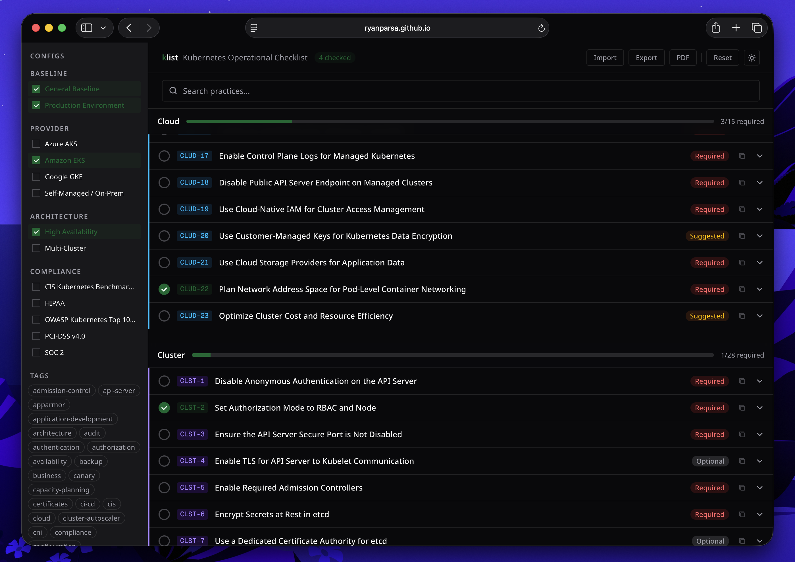

# klist

**Interactive Kubernetes operational checklist.**

klist helps platform and DevOps teams verify that a Kubernetes cluster is correctly configured, hardened, and operationally ready for production. It covers the full spectrum of what makes a cluster stable, compliant, and maintainable - not just security scanning.

Checks are organised around the **4C model** (Cloud, Cluster, Container, Code) and can be filtered by environment, provider, architecture, and compliance framework. Item priorities adjust dynamically based on your selected configurations.

**Live:** [ryanparsa.github.io/klist](https://ryanparsa.github.io/klist/)

## Related Projects

- [kubernetes-project-baseline](https://github.com/ryanparsa/kubernetes-project-baseline) - Production-ready Kubernetes namespace/service baseline
- [kubernetes-certification](https://github.com/ryanparsa/kubernetes-certification) - CKA/KCNA/KCSA certification training scenarios




---

## Features

- **Dynamic priorities** - select configs (EKS, SOC 2, production…) and items are automatically promoted to Required, Suggested, or Optional
- **Per-section progress** - track completion across 121 items spanning Cloud (23), Cluster (53), Container (29), and Code (16) layers
- **Search and tag filter** - quickly find items across all categories
- **Shareable URL** - active config and tag selections are encoded in the query string
- **Export / Import** - save and restore a full session as JSON
- **PDF export** - clean print view via `window.print()`
- **No backend** - fully static, runs in the browser

---

## Running locally

```bash
git clone https://github.com/ryanparsa/klist.git
cd klist/dashboard
npm install
npm run dev
```

The app is available at `http://localhost:3000`.

---

## Project structure

```
klist/
├── practices/
│   ├── cloud/          # CLUD-xxx.yaml  (23 items)
│   ├── cluster/        # CLST-xxx.yaml  (53 items)
│   ├── container/      # CONT-xxx.yaml  (29 items)
│   ├── code/           # CODE-xxx.yaml  (16 items)
│   └── config/         # one .yaml per config profile (13 configs)
│
└── dashboard/          # Next.js application
    ├── app/            # pages and layouts
    ├── components/     # UI components
    ├── hooks/          # React hooks
    ├── lib/            # utilities and filter logic
    └── velite.config.ts  # content schema - YAML → typed collections
```

Content is processed at build time by [velite](https://velite.js.org/). Adding or editing a YAML file in `practices/` is immediately reflected during `npm run dev`.

---

## Contributing

See [CONTRIBUTING.md](CONTRIBUTING.md).
